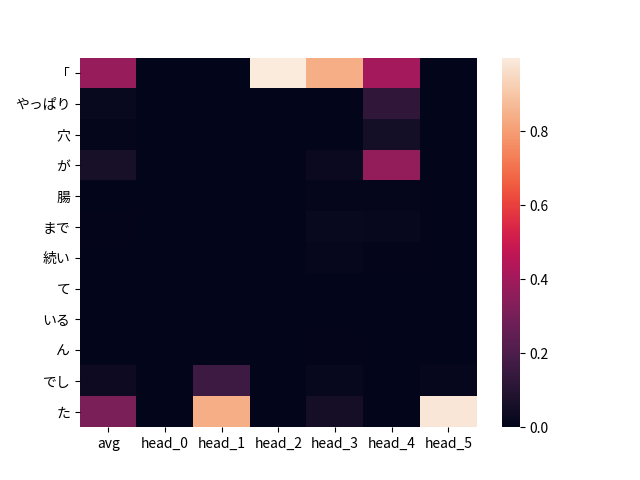

# 新的规划

## 实验了wiki2vec & attention memnet based sector

### 首先作为baseline的2:2 & 0 memsize
1. epoch = 0时候f1为0.51左右，还没有训练好
2. epoch = 4左右f1回升到0.76, 算是正常水准
3. 2：2比1：1效果要差，这是为何？

### 1:1 & memsize = 5效果正常水准
### 2:2 & memsize = 5效果正常水准
### 2:2 & memsize = 2效果正常水准

## 试验了双层sentence compressor & 双层sentence integrator

性能不升反降


## 对分割进行分析

使用方法:

```py
from wikiattmem import *
import utils_lite as U
m = AttMemNet(head = 6, memory_size = 0)
inpts = labels = None # Get inpts & labels by yourself
o, sentence_scores, word_scores_per_sentence, memory_info = m.dry_run(inpts, labels, checking = True)
pos = 0 # Sentence index
U.draw_head_attention(word_scores_per_sentence[pos], memory_info[pos], path='out.png')
```




## 实验记录

现在池化模型精度应该是最高的，以这个实验为基点，进行探索分析

```
# 没有FL
## TODO: BASELINE 1:2
## BASELINE 1:1
# TEST
{'prec': 0.911746, 'rec': 0.734601, 'f1': 0.813643, 'bacc': 0.859621}
{'prec': 0.975086, 'rec': 0.705558, 'f1': 0.818710, 'bacc': 0.850832}
{'prec': 0.946954, 'rec': 0.724086, 'f1': 0.820658, 'bacc': 0.857662}
{'prec': 0.946856, 'rec': 0.731597, 'f1': 0.825423, 'bacc': 0.861363}
{'prec': 0.946989, 'rec': 0.724586, 'f1': 0.820992, 'bacc': 0.857912}

# DEV
{'prec': 0.779951, 'rec': 0.471196, 'f1': 0.587476, 'bacc': 0.725317}
{'prec': 0.849397, 'rec': 0.416543, 'f1': 0.558969, 'bacc': 0.702560}
{'prec': 0.788659, 'rec': 0.451994, 'f1': 0.574647, 'bacc': 0.716629}
{'prec': 0.780722, 'rec': 0.478581, 'f1': 0.593406, 'bacc': 0.728895}
{'prec': 0.824289, 'rec': 0.471196, 'f1': 0.599624, 'bacc': 0.727830}
## BASELINE 2:2
#### #9 Double Sentence
# TEST (avg f1 0.8261207760292912)
{'prec': 0.951219, 'rec': 0.722583, 'f1': 0.821286, 'bacc': 0.857289}
{'prec': 0.956919, 'rec': 0.734101, 'f1': 0.830830, 'bacc': 0.863481}
{'prec': 0.903015, 'rec': 0.764646, 'f1': 0.828091, 'bacc': 0.873453}
{'prec': 0.906836, 'rec': 0.750625, 'f1': 0.821369, 'bacc': 0.866984}
{'prec': 0.865866, 'rec': 0.795192, 'f1': 0.829026, 'bacc': 0.884291}

# DEV
{'prec': 0.787634, 'rec': 0.432791, 'f1': 0.558627, 'bacc': 0.707371}
{'prec': 0.807894, 'rec': 0.453471, 'f1': 0.580889, 'bacc': 0.718396}
{'prec': 0.661870, 'rec': 0.543574, 'f1': 0.596918, 'bacc': 0.750311}
{'prec': 0.676300, 'rec': 0.518463, 'f1': 0.586956, 'bacc': 0.740040}
{'prec': 0.651542, 'rec': 0.530280, 'f1': 0.584690, 'bacc': 0.743207}

```
## 左右池化1:2
{
  "testdic": {
    "prec": 0.9283935242839353,
    "rec": 0.7462462462462462,
    "f1": 0.8274139844617093,
    "bacc": 0.8669035449727716
  },
  "devdic": {
    "prec": 0.724669603524229,
    "rec": 0.48525073746312686,
    "f1": 0.5812720848056536,
    "bacc": 0.7283461820740355
  },
  "desc": "池化epoch压测: epoch2"
}
{
  "testdic": {
    "prec": 0.8866513233601842,
    "rec": 0.7712712712712713,
    "f1": 0.8249464668094219,
    "bacc": 0.8749812278476421
  },
  "devdic": {
    "prec": 0.6624775583482945,
    "rec": 0.5442477876106194,
    "f1": 0.5975708502024292,
    "bacc": 0.7506479970723876
  },
  "desc": "试着池化, 跑四次，每次2epoch"
}
{
  "testdic": {
    "prec": 0.9224190592547342,
    "rec": 0.7557557557557557,
    "f1": 0.8308115543328747,
    "bacc": 0.8710093002683592
  },
  "devdic": {
    "prec": 0.7325842696629213,
    "rec": 0.4808259587020649,
    "f1": 0.5805877114870882,
    "bacc": 0.7268191936530658
  },
  "desc": "试着池化, 跑四次，每次2epoch"
}
{
  "testdic": {
    "prec": 0.9159049360146252,
    "rec": 0.7522522522522522,
    "f1": 0.8260511129431162,
    "bacc": 0.8686626323457043
  },
  "devdic": {
    "prec": 0.7213822894168467,
    "rec": 0.49262536873156343,
    "f1": 0.5854513584574934,
    "bacc": 0.7315765637352128
  },
  "desc": "试着池化, 跑四次，每次2epoch"
}
{
  "testdic": {
    "prec": 0.8720800889877642,
    "rec": 0.7847847847847848,
    "f1": 0.8261327713382508,
    "bacc": 0.8799532360916893
  },
  "devdic": {
    "prec": 0.6296296296296297,
    "rec": 0.551622418879056,
    "f1": 0.5880503144654089,
    "bacc": 0.7506798409222788
  },
  "desc": "试着池化, 跑四次，每次2epoch"
}
{
  "testdic": {
    "prec": 0.9273638071383845,
    "rec": 0.7412412412412412,
    "f1": 0.823922114047288,
    "bacc": 0.8643469591820052
  },
  "devdic": {
    "prec": 0.7163865546218487,
    "rec": 0.5029498525073747,
    "f1": 0.5909878682842288,
    "bacc": 0.7360534046635572
  },
  "desc": "左右池化"
}

{
  "testdic": {
    "prec": 0.9101258238466148,
    "rec": 0.7602602602602603,
    "f1": 0.8284701390782657,
    "bacc": 0.8720176368905412
  },
  "devdic": {
    "prec": 0.6824457593688363,
    "rec": 0.5103244837758112,
    "f1": 0.5839662447257384,
    "bacc": 0.7367706494730095
  },
  "desc": "左右池化"
}
{
  "testdic": {
    "prec": 0.9378603459320948,
    "rec": 0.7327327327327328,
    "f1": 0.8227030064624894,
    "bacc": 0.8611202874047655
  },
  "devdic": {
    "prec": 0.7493917274939172,
    "rec": 0.45427728613569324,
    "f1": 0.5656565656565657,
    "bacc": 0.7153725932620436
  },
  "desc": "左右池化"
}

# FL
{
  "testdic": {
    "prec": 0.9241773962804005,
    "rec": 0.6466466466466466,
    "f1": 0.7608951707891636,
    "bacc": 0.8175904947673471
  },
  "devdic": {
    "prec": 0.6933333333333334,
    "rec": 0.46017699115044247,
    "f1": 0.5531914893617021,
    "bacc": 0.7143242735053104
  },
  "desc": "左右池化, flrate=5"
}

# Baseline 1:1
{
  "testdic": {
    "prec": 0.8991596638655462,
    "rec": 0.7497497497497497,
    "f1": 0.8176855895196506,
    "bacc": 0.8657888824465352
  },
  "devdic": {
    "prec": 0.6678635547576302,
    "rec": 0.5486725663716814,
    "f1": 0.6024291497975708,
    "bacc": 0.7532030869326993
  },
  "desc": "BASELINE rate = 5"
}
{
  "testdic": {
    "prec": 0.9420476497102382,
    "rec": 0.7322322322322322,
    "f1": 0.8239932413404675,
    "bacc": 0.8612486201723628
  },
  "devdic": {
    "prec": 0.7858880778588808,
    "rec": 0.47640117994100295,
    "f1": 0.593204775022957,
    "bacc": 0.7281480425636018
  },
  "desc": "BASELINE rate = 5"
}
{
  "testdic": {
    "prec": 0.9563780568407139,
    "rec": 0.7242242242242243,
    "f1": 0.8242665907148962,
    "bacc": 0.858542615086693
  },
  "devdic": {
    "prec": 0.8136020151133502,
    "rec": 0.47640117994100295,
    "f1": 0.6009302325581396,
    "bacc": 0.729747311469245
  },
  "desc": "BASELINE rate = 5"
}
## 2:2
{
  "testdic": {
    "prec": 0.8981481481481481,
    "rec": 0.7282282282282282,
    "f1": 0.8043117744610282,
    "bacc": 0.8551903715505662
  },
  "devdic": {
    "prec": 0.7600950118764845,
    "rec": 0.471976401179941,
    "f1": 0.5823475887170154,
    "bacc": 0.7244506177706879
  },
  "desc": "加大长度2:2 rate = 5"
}
{
  "testdic": {
    "prec": 0.8376731301939058,
    "rec": 0.7567567567567568,
    "f1": 0.7951617144359716,
    "bacc": 0.8625319749170479
  },
  "devdic": {
    "prec": 0.7024291497975709,
    "rec": 0.5117994100294986,
    "f1": 0.5921501706484642,
    "bacc": 0.7391073815054964
  },
  "desc": "加大长度2:2 rate = 5"
}
{
  "testdic": {
    "prec": 0.8977884040645547,
    "rec": 0.7517517517517518,
    "f1": 0.8183056387905203,
    "bacc": 0.8666276335827445
  },
  "devdic": {
    "prec": 0.7450980392156863,
    "rec": 0.504424778761062,
    "f1": 0.6015831134564643,
    "bacc": 0.7388470706690848
  },
  "desc": "加大长度2:2 rate = 5"
}
## 1:1 rate = 6
{
  "testdic": {
    "prec": 0.9344262295081968,
    "rec": 0.7417417417417418,
    "f1": 0.8270089285714286,
    "bacc": 0.8652462088914226
  },
  "devdic": {
    "prec": 0.7391304347826086,
    "rec": 0.5014749262536873,
    "f1": 0.5975395430579964,
    "bacc": 0.7370294439356168
  },
  "desc": "1:1但是提升衰减率rate = 6"
}
## 1:2 [CLS]池化, flrate=0
{
  "testdic": {
    "prec": 0.9320024953212727,
    "rec": 0.7477477477477478,
    "f1": 0.8297695084698695,
    "bacc": 0.867978795453106
  },
  "devdic": {
    "prec": 0.6834677419354839,
    "rec": 0.5,
    "f1": 0.5775127768313457,
    "bacc": 0.7320653415581448
  },
  "desc": "1:2 [CLS]池化, flrate=0"
}
{
  "testdic": {
    "prec": 0.9077757685352622,
    "rec": 0.7537537537537538,
    "f1": 0.8236259228876128,
    "bacc": 0.8686021337724961
  },
  "devdic": {
    "prec": 0.6699029126213593,
    "rec": 0.5088495575221239,
    "f1": 0.57837384744342,
    "bacc": 0.7350050849068239
  },
  "desc": "1:2 [CLS]池化, flrate=0"
}
{
  "testdic": {
    "prec": 0.9441233140655106,
    "rec": 0.7357357357357357,
    "f1": 0.8270042194092827,
    "bacc": 0.8631626217889062
  },
  "devdic": {
    "prec": 0.7758186397984886,
    "rec": 0.45427728613569324,
    "f1": 0.5730232558139534,
    "bacc": 0.7169718621676867
  },
  "desc": "1:2 [CLS]池化, flrate=0"
}
# 1:2 [SEP]池化, flrate=0
{
  "testdic": {
    "prec": 0.9265536723163842,
    "rec": 0.7387387387387387,
    "f1": 0.8220551378446116,
    "bacc": 0.8630416246424899
  },
  "devdic": {
    "prec": 0.7290748898678414,
    "rec": 0.4882005899705015,
    "f1": 0.5848056537102473,
    "bacc": 0.7300495753142432
  },
  "desc": "1:2 [SEP]池化, flrate=0"
}
{
  "testdic": {
    "prec": 0.9336734693877551,
    "rec": 0.7327327327327328,
    "f1": 0.8210880538418396,
    "bacc": 0.8607417043869181
  },
  "devdic": {
    "prec": 0.7417840375586855,
    "rec": 0.46607669616519176,
    "f1": 0.572463768115942,
    "bacc": 0.7204726638239712
  },
  "desc": "1:2 [SEP]池化, flrate=0"
}
{
  "testdic": {
    "prec": 0.8983451536643026,
    "rec": 0.7607607607607607,
    "f1": 0.8238482384823848,
    "bacc": 0.8710780547989849
  },
  "devdic": {
    "prec": 0.6924564796905223,
    "rec": 0.528023598820059,
    "f1": 0.599163179916318,
    "bacc": 0.7458486739816539
  },
  "desc": "1:2 [SEP]池化, flrate=0"
}
# 1:2 [MEAN]池化, flrate=0
{
  "testdic": {
    "prec": 0.8903712296983759,
    "rec": 0.7682682682682682,
    "f1": 0.8248253627082213,
    "bacc": 0.8739123926522521
  },
  "devdic": {
    "prec": 0.6369982547993019,
    "rec": 0.5383480825958702,
    "f1": 0.583533173461231,
    "bacc": 0.7454134746998085
  },
  "desc": "1:2 [MEAN]池化, flrate=0"
}
{
  "testdic": {
    "prec": 0.900990099009901,
    "rec": 0.7742742742742743,
    "f1": 0.8328398384925976,
    "bacc": 0.8779429781322696
  },
  "devdic": {
    "prec": 0.6440677966101694,
    "rec": 0.56047197640118,
    "f1": 0.5993690851735016,
    "bacc": 0.7562469546159429
  },
  "desc": "1:2 [MEAN]池化, flrate=0"
}
{
  "testdic": {
    "prec": 0.9093655589123867,
    "rec": 0.7532532532532532,
    "f1": 0.823980290172461,
    "bacc": 0.8685141333870376
  },
  "devdic": {
    "prec": 0.7034220532319392,
    "rec": 0.5457227138643068,
    "f1": 0.6146179401993357,
    "bacc": 0.7550409319835585
  },
  "desc": "1:2 [MEAN]池化, flrate=0"
}
# 1:2 [CLS]池化, flrate=5
{
  "testdic": {
    "prec": 0.9158730158730158,
    "rec": 0.5775775775775776,
    "f1": 0.7084100675260896,
    "bacc": 0.7830559602328127
  },
  "devdic": {
    "prec": 0.7028301886792453,
    "rec": 0.43952802359882004,
    "f1": 0.5408348457350272,
    "bacc": 0.7053705916486218
  },
  "desc": "1:2 [CLS]池化, flrate=5"
}
{
  "testdic": {
    "prec": 0.9572829131652661,
    "rec": 0.6841841841841841,
    "f1": 0.7980151780502043,
    "bacc": 0.8387930115079926
  },
  "devdic": {
    "prec": 0.7983193277310925,
    "rec": 0.42035398230088494,
    "f1": 0.5507246376811595,
    "bacc": 0.7019521796357063
  },
  "desc": "1:2 [CLS]池化, flrate=5"
}
{
  "testdic": {
    "prec": 0.9192139737991266,
    "rec": 0.2107107107107107,
    "f1": 0.34283387622149836,
    "bacc": 0.60335427368959
  },
  "devdic": {
    "prec": 0.7125748502994012,
    "rec": 0.17551622418879056,
    "f1": 0.28165680473372784,
    "bacc": 0.5822749044179045
  },
  "desc": "1:2 [CLS]池化, flrate=5"
}
# 1:2 [SEP]池化, flrate=5
{
  "testdic": {
    "prec": 0.9643835616438357,
    "rec": 0.7047047047047047,
    "f1": 0.8143435511856564,
    "bacc": 0.8495400213626282
  },
  "devdic": {
    "prec": 0.7956403269754768,
    "rec": 0.4306784660766962,
    "f1": 0.5588516746411484,
    "bacc": 0.7067717210438313
  },
  "desc": "1:2 [SEP]池化, flrate=5"
}
{
  "testdic": {
    "prec": 0.9832361516034985,
    "rec": 0.6751751751751752,
    "f1": 0.800593471810089,
    "bacc": 0.8363436719575172
  },
  "devdic": {
    "prec": 0.8916967509025271,
    "rec": 0.36430678466076694,
    "f1": 0.5172774869109948,
    "bacc": 0.6787263875325767
  },
  "desc": "1:2 [SEP]池化, flrate=5"
}
{
  "testdic": {
    "prec": 0.9389312977099237,
    "rec": 0.7387387387387387,
    "f1": 0.8268907563025211,
    "bacc": 0.8641773736960324
  },
  "devdic": {
    "prec": 0.7718446601941747,
    "rec": 0.4690265486725664,
    "f1": 0.5834862385321101,
    "bacc": 0.7237753259698222
  },
  "desc": "1:2 [SEP]池化, flrate=5"
}
# 1:2 [MEAN]池化, flrate=5
{
  "testdic": {
    "prec": 0.8790968681718864,
    "rec": 0.6041041041041041,
    "f1": 0.7161079798279443,
    "bacc": 0.7930742262002403
  },
  "devdic": {
    "prec": 0.6403162055335968,
    "rec": 0.4778761061946903,
    "f1": 0.5472972972972973,
    "bacc": 0.7181475573239844
  },
  "desc": "1:2 [MEAN]池化, flrate=5"
}
{
  "testdic": {
    "prec": 0.9661705006765899,
    "rec": 0.7147147147147147,
    "f1": 0.8216340621403911,
    "bacc": 0.854653192944161
  },
  "devdic": {
    "prec": 0.8102981029810298,
    "rec": 0.4410029498525074,
    "f1": 0.5711556829035339,
    "bacc": 0.712505130398038
  },
  "desc": "1:2 [MEAN]池化, flrate=5"
}
{
  "testdic": {
    "prec": 0.9289198606271777,
    "rec": 0.6671671671671672,
    "f1": 0.7765802505097582,
    "bacc": 0.8280670881806631
  },
  "devdic": {
    "prec": 0.7571428571428571,
    "rec": 0.4690265486725664,
    "f1": 0.5792349726775956,
    "bacc": 0.7228614580237404
  },
  "desc": "1:2 [MEAN]池化, flrate=5"
}


```


