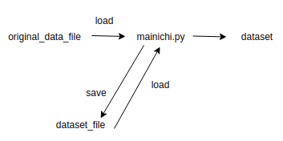

## 使い方


```py
from sector_split import *

run_big() # or other experiment functions
```

## 毎日新聞Datasetの読む流れ



## How to custom your `dataset_file`?

```
from mainichi import *
structed_articles = standard_process()
# Try this: print(structed_articles[0]), You will understand what is structed_articles
customize_my_dataset_and_save(structed_articles) # This function is all you need to change
```

The important thing is, the customized dataset saved should be `human-readable`.

